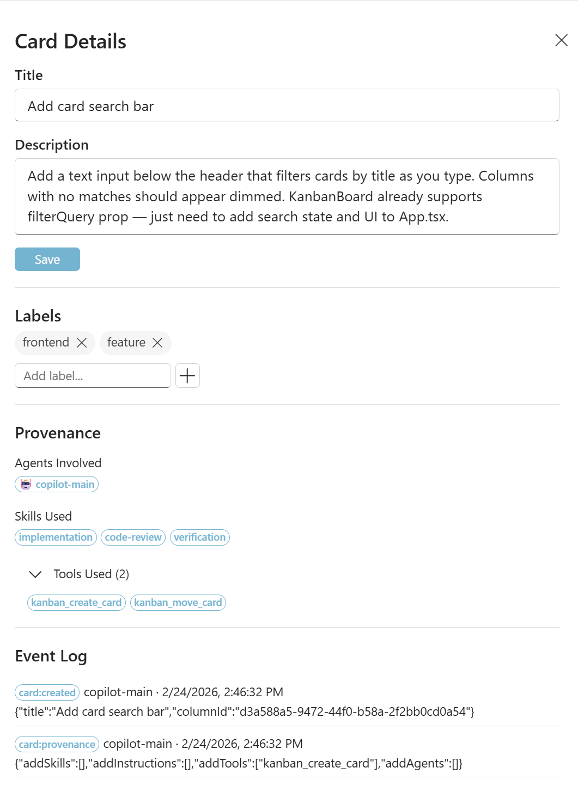

# GitHub Copilot CLI Board

A local Kanban board that GitHub Copilot CLI agents update automatically via MCP while they work. You give the agent a task, and the board shows you what it is doing in real time: cards appear, move across columns, and carry a full audit trail of what happened and why.


When Copilot CLI agents work, their progress is buried in terminal output. You cannot tell what they are doing, whether they are stuck, or how they structured the work. This board gives you a live, visual dashboard of agent activity. Cards move across columns in real time as the agent plans, codes, reviews, and completes tasks. Each card carries provenance: who did the work, what tools were used, and how it was validated. For anyone who already manages work in Azure DevOps Boards, Jira, or Trello, this is immediately familiar. Same mental model, same workflow, but now the agent is the one moving the cards.

## Features

- **Real-time Kanban board** with drag-and-drop columns (Backlog, Planned, In Progress, Review, Blocked, Done)
- **Agent-driven updates** via MCP: Copilot CLI agents create, move, and update cards as they work
- **Live SSE streaming**: board updates in real time without page refresh
- **Provenance tracking**: every card records which agent, skills, instructions, and tools were used
- **Content labels**: multi-label support for categorizing cards (frontend, backend, bugfix, etc.)
- **Event log**: full audit trail of every action taken on a card
- **Archive support**: soft-delete cards to keep the board clean without losing history
- **Security**: localhost-only binding, optional bearer token auth, no cloud dependency
- **Fluent UI**: modern, clean interface inspired by the Windows Fluent design system
- **Light and dark themes**: adapts to your system theme preference

## Quick start

```bash
# Install dependencies
pnpm install

# Start the board server and web UI
pnpm dev
```

- Board UI: http://127.0.0.1:5173
- Board API: http://127.0.0.1:4800

## Project structure

```
apps/
  server/    Express + SQLite board service (REST + SSE)
  ui/        React + Fluent UI web frontend
  mcp/       MCP server (stdio) exposing kanban_* tools
  sim/       Simulator CLI for testing scenarios (see apps/sim/README.md)
demo/        Demo prompt, revert script, and instructions (see demo/README.md)
img/         Screenshots and images
packages/
  shared/    Shared TypeScript types
CHANGELOG.md
CONTRIBUTING.md
LICENSE
```

## Setting up the MCP server

### Option 1: Add via Copilot CLI

```bash
/mcp add copilot-cli-board -- /path/to/copilot-cli-board/apps/mcp/node_modules/.bin/tsx /path/to/copilot-cli-board/apps/mcp/src/index.ts
```

### Option 2: Add manually to MCP config

Add to `~/.copilot/mcp-config.json`:

```json
{
  "mcpServers": {
    "copilot-cli-board": {
      "type": "stdio",
      "command": "/path/to/copilot-cli-board/apps/mcp/node_modules/.bin/tsx",
      "args": ["/path/to/copilot-cli-board/apps/mcp/src/index.ts"],
      "env": {
        "COPILOT_CLI_BOARD_URL": "http://127.0.0.1:4800"
      }
    }
  }
}
```

Replace `/path/to/copilot-cli-board` with the absolute path to this project.

### Option 3: Project-level config

Add `.copilot/mcp.json` to any repo that should use the board:

```json
{
  "servers": {
    "copilot-cli-board": {
      "type": "stdio",
      "command": "/path/to/copilot-cli-board/apps/mcp/node_modules/.bin/tsx",
      "args": ["/path/to/copilot-cli-board/apps/mcp/src/index.ts"],
      "env": {
        "COPILOT_CLI_BOARD_URL": "http://127.0.0.1:4800"
      }
    }
  }
}
```

## Agent instructions

Copy `.github/copilot-instructions.md` into any repo where you want agents to use the board. This tells agents to create cards, follow the column workflow, and record provenance automatically. No changes to your prompts are needed.

## MCP tools

| Tool                             | Description                       |
|----------------------------------|-----------------------------------|
| `kanban_get_board`               | Get full board snapshot           |
| `kanban_create_card`             | Create a new card                 |
| `kanban_move_card`               | Move card to a column             |
| `kanban_update_card`             | Update title or description       |
| `kanban_set_labels`              | Set exact label set on a card     |
| `kanban_append_event`            | Add event to card log             |
| `kanban_archive_card`            | Soft-delete a card                |
| `kanban_unarchive_card`          | Restore archived card             |
| `kanban_record_skill_use`        | Record skill provenance           |
| `kanban_record_instruction_use`  | Record instruction provenance     |
| `kanban_record_tool_use`         | Record tool provenance            |

## Agent workflow

Agents follow this workflow automatically (via copilot-instructions.md):

1. Create card in Backlog, then move to Planned
2. Move to In Progress when starting work
3. Move to Review when code is ready, with a summary event
4. Move to Done after verifying the feature works, with a final summary event
5. Move to Blocked with a note if stuck

Each card tracks which agent did the work, what skills and tools were used, and what instructions were followed.

## Default columns

| Column      | Purpose                    |
|-------------|----------------------------|
| Backlog     | Tasks not yet planned      |
| Planned     | Queued for work            |
| In Progress | Currently being worked on  |
| Review      | Code ready, being verified |
| Blocked     | Stuck, needs intervention  |
| Done        | Completed and verified     |

## Card anatomy

Each card on the board captures the full context of a task:



- **Title**: verb-first description of the task (e.g., "Implement rate limiting")
- **Description**: additional context, requirements, or notes
- **Labels**: content tags for categorization (e.g., `backend`, `bugfix`, `frontend`)
- **Provenance**: which agent did the work, what skills were used, what instructions were followed, and what tools were involved
- **Event log**: timestamped audit trail of every action (moves, status changes, test results, summaries)

Cards are atomic tasks with verifiable outcomes. Split tasks when they are independent or touch different areas. Archive cards instead of deleting them.

## Security

- Server binds to `127.0.0.1` only (never `0.0.0.0`)
- Optional auth: set `COPILOT_CLI_BOARD_TOKEN` env var to require a Bearer token for mutations
- CORS restricted to localhost UI origin
- No cloud dependency, everything runs locally

## Data storage

SQLite database at `.copilot-cli-board/board.db`. Delete this directory to reset.

MCP server logs at `.copilot-cli-board/mcp.log`.

## Environment variables

| Variable                   | Default                  | Description                      |
|----------------------------|--------------------------|----------------------------------|
| `PORT`                     | `4800`                   | Board server port                |
| `UI_ORIGIN`                | `http://localhost:5173`  | Allowed CORS origin              |
| `COPILOT_CLI_BOARD_TOKEN`  | (unset)                  | Bearer token for mutations       |
| `COPILOT_CLI_BOARD_URL`    | `http://127.0.0.1:4800`  | Board API URL (for MCP server)   |

## Demo

See `demo/README.md` for the demo prompt, what to expect, and how to revert.

```bash
# Reset the board and undo demo changes
bash demo/revert.sh
```

## Simulator

A separate CLI tool for testing the board API without Copilot CLI. See `apps/sim/README.md`.

```bash
pnpm sim:happy-path
pnpm sim:blocked
pnpm sim:multi-agent
```

## Contributing

See [CONTRIBUTING.md](CONTRIBUTING.md).

## Changelog

See [CHANGELOG.md](CHANGELOG.md).

## License

This project is licensed under the MIT License. See [LICENSE](LICENSE) for details.
